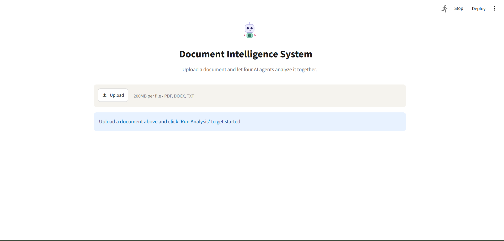
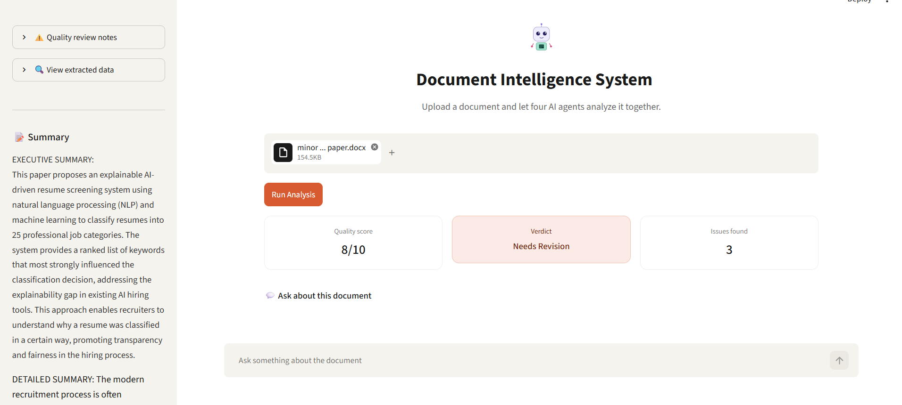
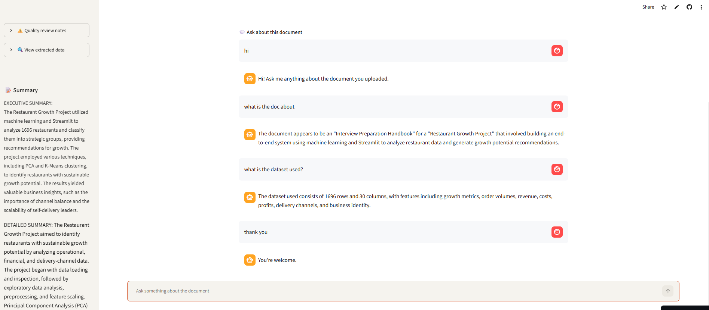
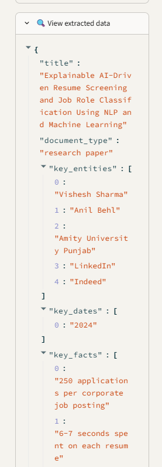

# Multi-Agent Document Intelligence System

A multi-agent AI system that analyzes documents (PDF, DOCX, TXT) using specialized agents that collaborate, critique each other's work, and self-correct — built with LangGraph, Groq (Llama 3.3), and local embeddings.

**Live demo:** [doc-intelligence-vishesh99.streamlit.app](https://doc-intelligence-vishesh99.streamlit.app/)

## Screenshots

**Landing page**


**After analysis — summary, score cards, and sidebar**


**Chat-style question answering**


**Quality review (expanded)**


**Extracted data (expanded)**


## What it does

Upload any document and four AI agents work together to:
- **Summarize** it (executive + detailed summary)
- **Extract** structured data (entities, dates, key facts) as JSON
- **Answer questions** about it in a chat interface using Retrieval-Augmented Generation (RAG)
- **Critique** the other agents' output for accuracy, completeness, and hallucinations — automatically triggering a retry if quality is low

Includes OCR fallback for scanned/image-based PDFs using Tesseract.

## Architecture

```
Orchestrator (LangGraph)
        │
        ├──▶ Summarizer
        │        │
        │        ▼
        ├──▶   Critic ──▶ needs_revision? ──▶ retry Summarizer (max 2x)
        │        │
        │        ▼ (approved)
        ├──▶ Extractor
        │
        └──▶ QA (RAG)
```

## Tech Stack

- **LLM**: Groq API (Llama 3.3 70B) — free tier
- **Orchestration**: LangGraph
- **Embeddings**: sentence-transformers (local, free)
- **Vector store**: ChromaDB
- **OCR**: Tesseract (for scanned documents)
- **UI**: Streamlit
- **Document parsing**: PyMuPDF, python-docx

## Setup

1. Clone the repo:
   ```
   git clone <your-repo-url>
   cd doc-intelligence
   ```

2. Create a virtual environment:
   ```
   python -m venv venv
   venv\Scripts\activate      # Windows
   ```

3. Install dependencies:
   ```
   pip install -r requirements.txt
   ```

4. Install [Tesseract OCR](https://github.com/tesseract-ocr/tesseract/releases) and update the path in `app/loaders.py` if needed.

5. Get a free API key from [console.groq.com](https://console.groq.com) and add it to a `.env` file (copy `.env.example` and fill in your key):
   ```
   GROQ_API_KEY=your_key_here
   ```

6. Run the app:
   ```
   streamlit run main.py
   ```

## How it works

1. Document is loaded and chunked (with OCR fallback for scanned PDFs)
2. Summarizer agent generates a summary
3. Critic agent reviews the summary against the source document, scoring it and flagging issues
4. If flagged for revision, the Summarizer retries (up to 2 times)
5. Extractor agent pulls structured data into JSON
6. QA agent indexes the document into a vector store; questions are answered through a chat interface grounded only in the document's content

## Notes

This project was built to explore multi-agent orchestration patterns — specifically, having one agent review and trigger retries on another agent's output, rather than a single linear pipeline.